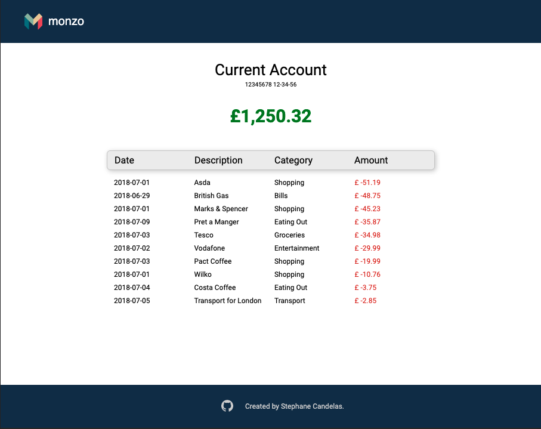

# The Smallest expense

### Description

The goal for this project was to

1. fetch expenses from this [endpoint](http://www.mocky.io/v2/5c62e7c33000004a00019b05)
2. filter the incomes
3. keep the 10 smallest expenses from the result and display them in the UI.

### Overview

;

### Tools

For this project I used Webpack, React, axios and Styled-Components.

### Available Scripts

Once you have cloned the repo you must run the command below to install all the dependencies.

```
npm install
```

In the project directory, you can run:

```
npm run test
```

Launches the test runner in the interactive watch mode.
Unit test cover all React components.

```
npm run start
```

Runs the app in the development mode.\
Open [http://localhost:8080](http://localhost:8080/) to view it in the browser.

The page will reload if you make edits.\
You will also see any lint errors in the console.

```
npm run build
```

This will build the application for production into the dist folder.
